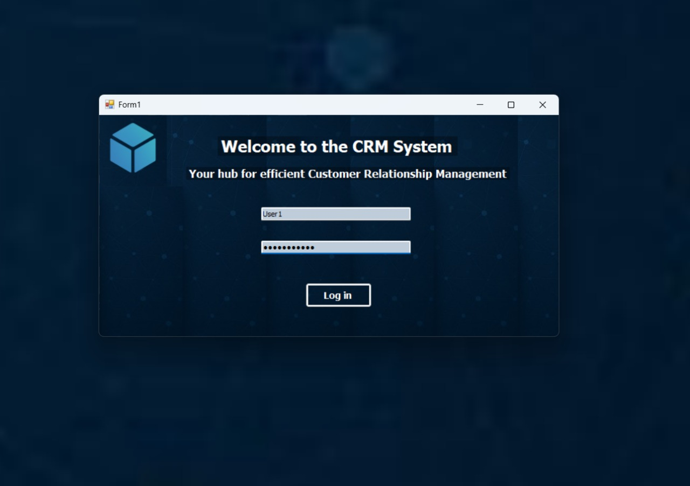
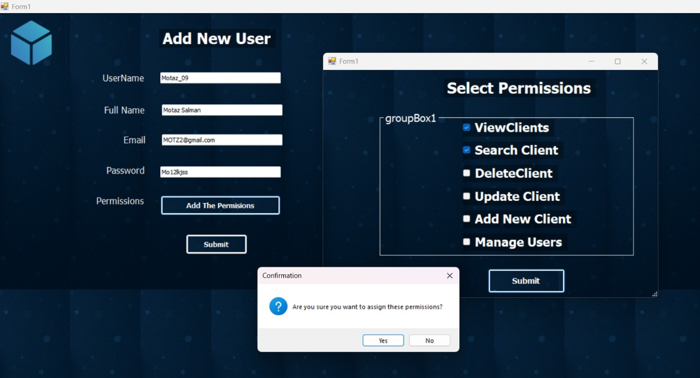
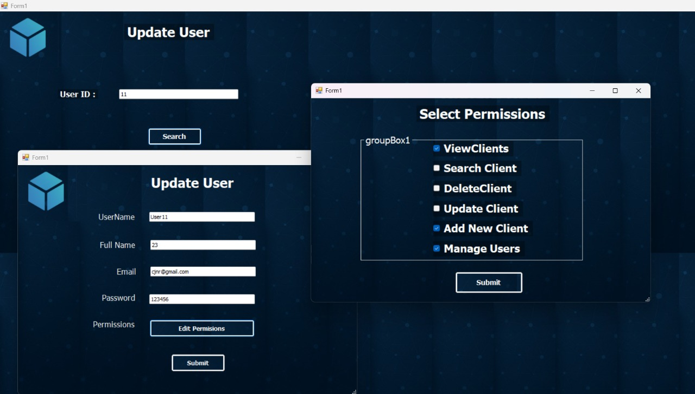
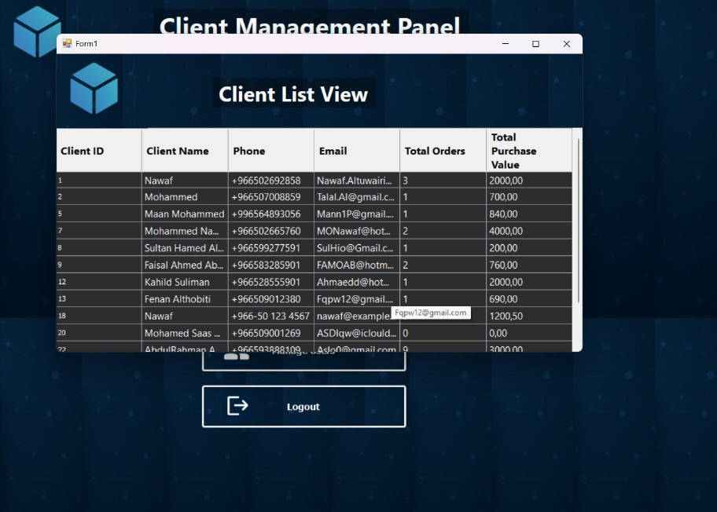
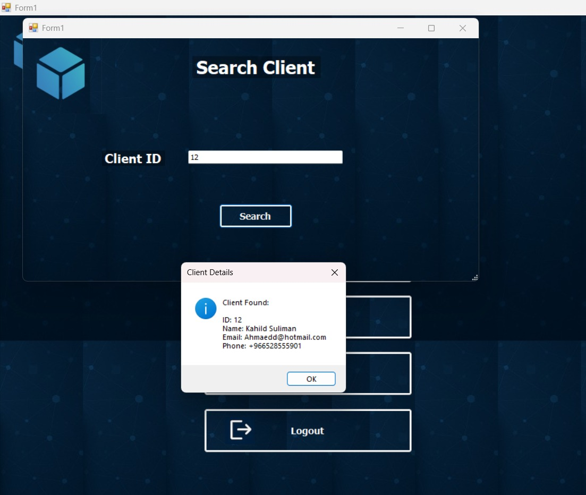
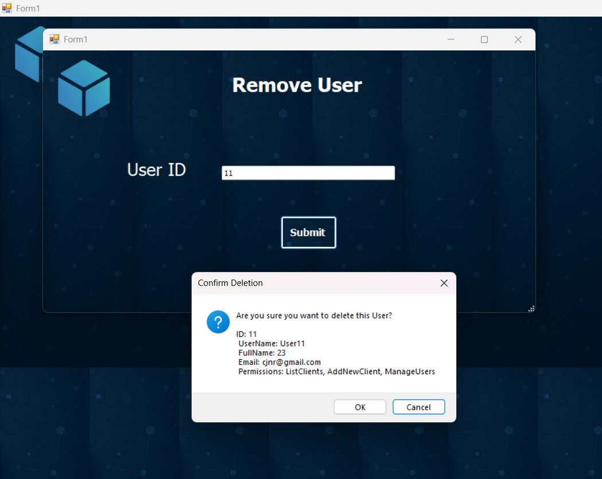

# CRM System (Windows Forms)

This is a simple CRM System developed using C# .NET and SQL Server.

## Features
- Add, edit, and delete customers
- User roles and permissions
- Dashboard with statistics

## Screenshots

**Login**  
  

**Add User**  
  

**User Roles**  
  

**Client List**  
  

**Search Client**  
  

**Remove User**  
  

## Installation
1. Clone the repository.
2. Open the solution file `.sln` in Visual Studio.
3. Restore NuGet packages if needed.
4. Update the database connection string in `App.config`.
5. Run the project.

## Demo Video
[Watch on YouTube](https://bit.ly/CRM-Project-Demo-Video)

---
Developed as part of my portfolio projects.
